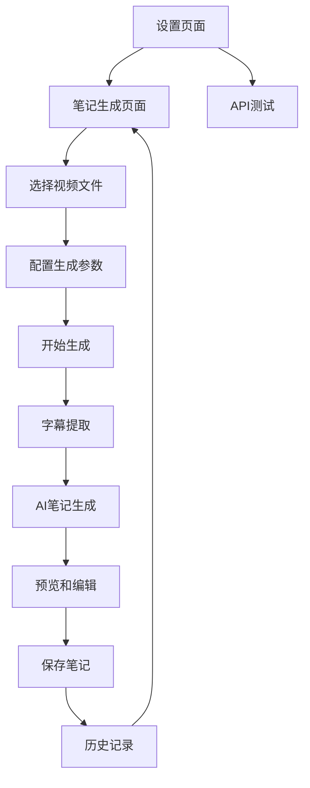

# 音视频AI笔记生成软件产品需求文档

## 1. 产品概述

本产品是一个基于本地Whisper模型的音视频字幕提取和AI智能总结软件，支持用户上传本地音视频文件，自动提取字幕内容，并通过多种大语言模型生成结构化笔记。

- 解决用户从音视频内容中快速提取关键信息和生成学习笔记的需求，提高学习和工作效率。
- 目标用户包括学生、研究人员、内容创作者等需要处理大量音视频资料的用户群体。

## 2. 核心功能

### 2.1 用户角色

本产品为单用户桌面应用，无需用户注册和权限管理。

### 2.2 功能模块

本软件需求包含以下主要页面：

1. **笔记生成页面**：视频文件选择、模型配置、笔记风格设置、生成历史记录、实时预览
2. **设置页面**：AI模型供应商配置、API密钥管理、连通性测试

### 2.3 页面详情

| 页面名称 | 模块名称 | 功能描述 |
|----------|----------|----------|
| 笔记生成页面 | 文件选择区域 | 选择本地音视频文件，支持常见格式（mp4、mp3、wav、avi等） |
| 笔记生成页面 | 配置面板 | 选择AI模型、设置笔记风格（学术、总结、要点等）、添加用户备注 |
| 笔记生成页面 | 历史记录 | 显示已生成的笔记列表，支持查看、删除、重新生成操作 |
| 笔记生成页面 | 预览区域 | 实时显示生成的笔记内容，支持Markdown渲染和导出 |
| 笔记生成页面 | 进度显示 | 显示字幕提取和AI生成的实时进度状态 |
| 设置页面 | AI模型供应商管理 | 配置OpenAI、Claude、Gemini、DeepSeek等AI服务商 |
| 设置页面 | API配置 | 设置API密钥、接口地址、模型参数 |
| 设置页面 | 连通性测试 | 测试各AI服务的API连接状态和可用性 |
| 设置页面 | Whisper模型选择 | 扫描并显示可用的Whisper模型，支持切换选择 |
| 设置页面 | 模型参数配置 | 配置Whisper模型的设备类型和计算精度 |

## 3. 核心流程

用户操作流程如下：

1. 用户在设置页面配置AI模型供应商和API密钥
2. 用户在设置页面选择要使用的Whisper模型
3. 在笔记生成页面选择本地音视频文件
4. 选择AI模型、笔记风格并添加备注信息
5. 系统使用选定的Whisper模型提取音频字幕
6. 将字幕内容、用户配置和提示词模板发送给选定的AI模型
7. AI模型返回结构化笔记内容
8. 用户可在预览区域查看和编辑笔记
9. 生成的笔记自动保存到输出文件夹

## 4. 用户界面设计

### 4.1 设计风格

- **主色调**：深蓝色(#2563eb)作为主色，浅灰色(#f8fafc)作为背景色
- **按钮样式**：圆角按钮，支持悬停和点击状态变化
- **字体**：系统默认字体，标题使用16-18px，正文使用14px
- **布局风格**：现代化卡片式布局，左侧导航栏设计
- **图标风格**：使用简洁的线性图标，支持主题色彩

### 4.2 页面设计概览

| 页面名称 | 模块名称 | UI元素 |
|----------|----------|--------|
| 笔记生成页面 | 文件选择区域 | 拖拽上传区域，文件浏览按钮，支持的格式提示 |
| 笔记生成页面 | 配置面板 | 下拉选择框（模型选择），单选按钮（笔记风格），文本输入框（备注） |
| 笔记生成页面 | 历史记录 | 列表组件，每项包含文件名、生成时间、操作按钮 |
| 笔记生成页面 | 预览区域 | Markdown编辑器，支持实时预览和语法高亮 |
| 设置页面 | AI模型配置 | 表单组件，开关按钮，输入框，测试按钮 |
| 设置页面 | Whisper模型选择 | 模型列表卡片，选择按钮，模型信息显示（大小、语言支持） |
| 设置页面 | API测试 | 状态指示器，测试结果显示区域 |

### 4.3 响应式设计

桌面优先设计，支持最小1024x768分辨率，界面元素支持窗口大小调整时的自适应布局。