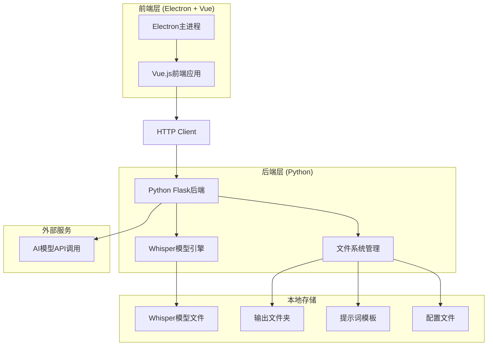
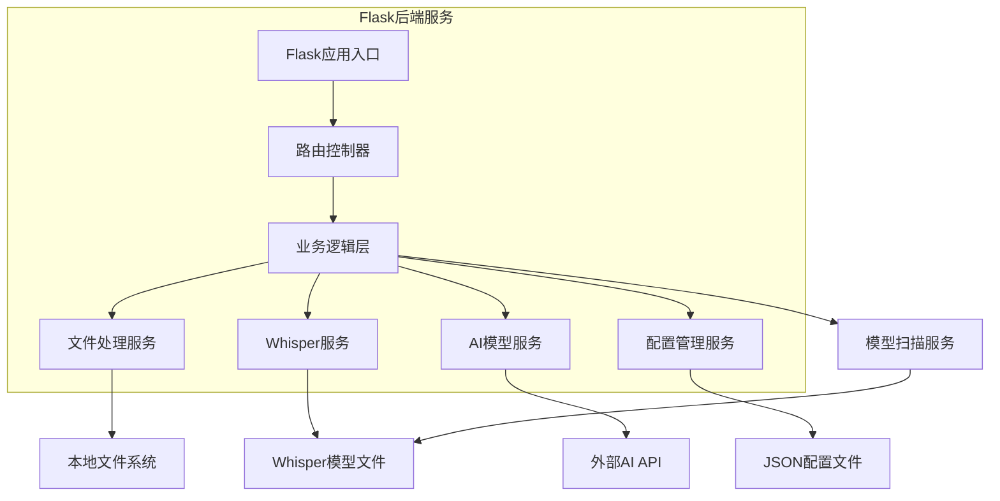
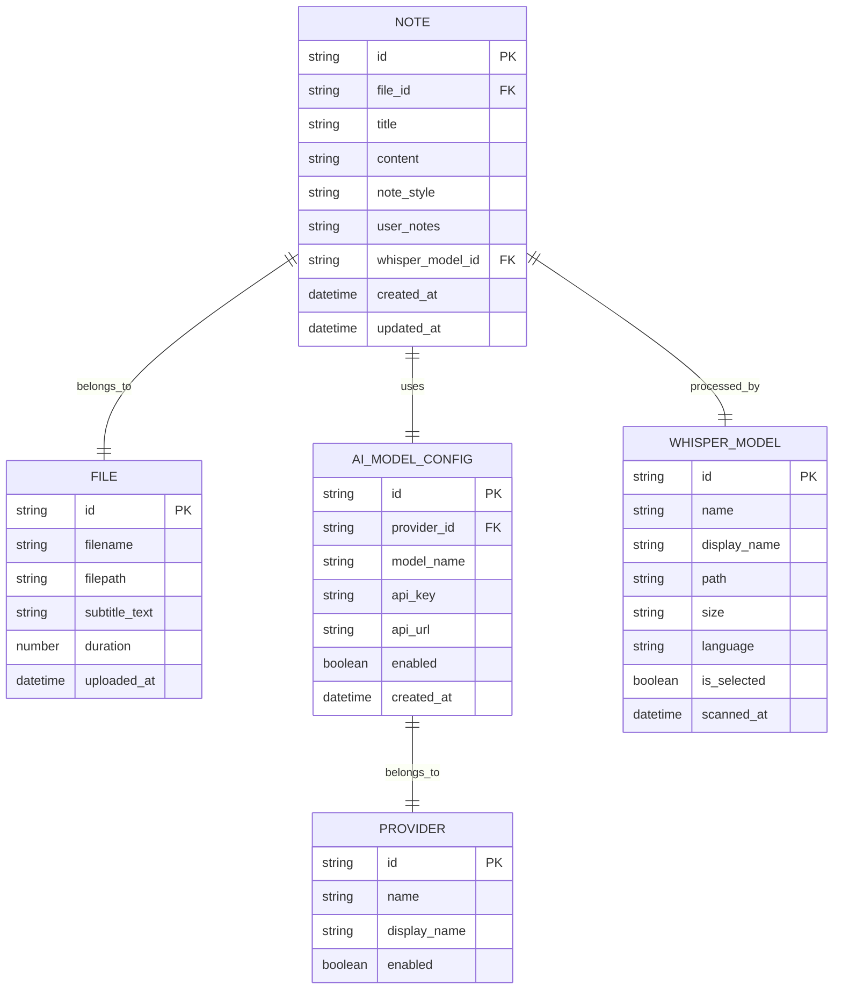

# 音视频AI笔记生成软件技术架构文档

## 1. 架构设计



## 2. 技术描述

* **前端**: Vue.js 3 + Electron + Element Plus + Vite + Pinia + Vue Router

* **后端**: Python 3.9+ + Flask + faster-whisper + requests

* **本地模型**: Faster-Whisper (已有模型文件)

* **外部API**: OpenAI、Claude、Gemini、DeepSeek等

## 3. 路由定义

| 路由        | 用途                            |
| --------- | ----------------------------- |
| /         | 主页面，重定向到笔记生成页面                |
| /notes    | 笔记生成页面，包含文件选择、配置和预览功能         |
| /settings | 设置页面，AI模型配置、Whisper模型选择和API管理 |
| /history  | 历史记录页面，查看和管理已生成的笔记            |

## 4. API定义

### 4.1 核心API

**文件上传和处理**

```
POST /api/upload
```

请求:

| 参数名称 | 参数类型 | 是否必需 | 描述    |
| ---- | ---- | ---- | ----- |
| file | File | true | 音视频文件 |

响应:

| 参数名称     | 参数类型    | 描述          |
| -------- | ------- | ----------- |
| success  | boolean | 上传状态        |
| msg      | string  | 操作结果信息或错误提示 |
| file\_id | string  | 文件唯一标识      |
| filename | string  | 文件名         |

示例响应:

```json
// 成功
{
  "success": true,
  "msg": "文件上传成功",
  "file_id": "uuid-123",
  "filename": "video.mp4"
}

// 失败
{
  "success": false,
  "msg": "文件格式不支持，请上传mp4、mp3、wav、avi等格式的文件"
}
```

**字幕提取**

```
POST /api/extract-subtitle
```

请求:

| 参数名称     | 参数类型   | 是否必需  | 描述          |
| -------- | ------ | ----- | ----------- |
| file\_id | string | true  | 文件标识        |
| model    | string | false | Whisper模型选择 |

响应:

| 参数名称           | 参数类型    | 描述          |
| -------------- | ------- | ----------- |
| success        | boolean | 提取状态        |
| msg            | string  | 操作结果信息或错误提示 |
| subtitle       | string  | 提取的字幕文本     |
| subtitle\_file | string  | 保存的字幕文件路径   |
| duration       | number  | 音频时长        |

示例响应:

```json
// 成功
{
  "success": true,
  "msg": "字幕提取完成",
  "subtitle": "这是提取的字幕内容...",
  "subtitle_file": "./Subtitles/video_20231201_123456.srt",
  "duration": 120.5
}

// 失败
{
  "success": false,
  "msg": "音频文件损坏或格式不支持，请检查文件完整性"
}
```

**AI笔记生成**

```
POST /api/generate-notes
```

请求:

| 参数名称            | 参数类型   | 是否必需  | 描述      |
| --------------- | ------ | ----- | ------- |
| subtitle        | string | true  | 字幕文本    |
| model\_provider | string | true  | AI模型供应商 |
| model\_name     | string | true  | 具体模型名称  |
| note\_style     | string | true  | 笔记风格    |
| user\_notes     | string | false | 用户备注    |

响应:

| 参数名称     | 参数类型    | 描述          |
| -------- | ------- | ----------- |
| success  | boolean | 生成状态        |
| msg      | string  | 操作结果信息或错误提示 |
| content  | string  | 生成的笔记内容     |
| note\_id | string  | 笔记唯一标识      |

示例响应:

```json
// 成功
{
  "success": true,
  "msg": "AI笔记生成成功",
  "content": "# 视频笔记\n\n## 主要内容\n...",
  "note_id": "note-uuid-456"
}

// 失败
{
  "success": false,
  "msg": "AI模型调用失败，请检查API密钥是否正确或网络连接是否正常"
}
```

**AI模型配置管理**

```
GET /api/ai-models
POST /api/ai-models
PUT /api/ai-models/{id}
DELETE /api/ai-models/{id}
```

**获取可用Whisper模型**

```
GET /api/whisper-models
```

响应:

| 参数名称    | 参数类型    | 描述          |
| ------- | ------- | ----------- |
| success | boolean | 请求状态        |
| msg     | string  | 操作结果信息或错误提示 |
| models  | array   | 可用模型列表      |

示例响应:

```json
// 成功
{
  "success": true,
  "msg": "模型列表获取成功",
  "models": [
    {
      "id": "faster-whisper-base",
      "name": "Faster Whisper Base",
      "path": "./Model/faster-whisper-base",
      "size": "39MB",
      "language": "多语言"
    }
  ]
}

// 失败
{
  "success": false,
  "msg": "模型文件夹不存在或无法访问，请检查Model目录"
}
```

模型对象结构:

| 参数名称     | 参数类型   | 描述     |
| -------- | ------ | ------ |
| id       | string | 模型唯一标识 |
| name     | string | 模型显示名称 |
| path     | string | 模型文件路径 |
| size     | string | 模型大小描述 |
| language | string | 支持语言   |

**设置Whisper模型**

```
POST /api/whisper-models/select
```

请求:

| 参数名称      | 参数类型   | 是否必需 | 描述       |
| --------- | ------ | ---- | -------- |
| model\_id | string | true | 要选择的模型ID |

响应:

| 参数名称    | 参数类型    | 描述          |
| ------- | ------- | ----------- |
| success | boolean | 设置状态        |
| msg     | string  | 操作结果信息或错误提示 |

示例响应:

```json
// 成功
{
  "success": true,
  "msg": "Whisper模型切换成功，当前使用: Faster Whisper Large V3 Turbo"
}

// 失败
{
  "success": false,
  "msg": "指定的模型不存在或文件损坏，请重新选择"
}
```

**API连通性测试**

```
POST /api/test-connection
```

请求:

| 参数名称     | 参数类型   | 是否必需 | 描述    |
| -------- | ------ | ---- | ----- |
| provider | string | true | 模型供应商 |
| api\_key | string | true | API密钥 |
| api\_url | string | true | API地址 |

响应:

| 参数名称    | 参数类型    | 描述          |
| ------- | ------- | ----------- |
| success | boolean | 连接状态        |
| msg     | string  | 操作结果信息或错误提示 |
| latency | number  | 响应延迟(ms)    |

示例响应:

```json
// 成功
{
  "success": true,
  "msg": "API连接测试成功，服务正常",
  "latency": 245
}

// 失败
{
  "success": false,
  "msg": "API密钥无效或已过期，请检查密钥配置",
  "latency": 0
}
```

## 5. 服务器架构图



## 6. 数据模型

### 6.1 数据模型定义



### 6.2 数据定义语言

**配置文件结构 (JSON)**

```json
{
  "ai_models": [
    {
      "id": "openai-gpt4",
      "provider": "openai",
      "name": "GPT-4",
      "api_key": "",
      "api_url": "https://api.openai.com/v1",
      "enabled": true
    },
    {
      "id": "claude-3",
      "provider": "anthropic",
      "name": "Claude-3",
      "api_key": "",
      "api_url": "https://api.anthropic.com",
      "enabled": false
    }
  ],
  "whisper": {
    "selected_model_id": "faster-whisper-large-v3-turbo",
    "device": "cpu",
    "compute_type": "int8",
    "available_models": [
      {
        "id": "faster-whisper-base",
        "name": "Faster Whisper Base",
        "path": "./Model/faster-whisper-base",
        "size": "39MB",
        "language": "多语言"
      },
      {
        "id": "faster-whisper-large-v3-turbo",
        "name": "Faster Whisper Large V3 Turbo",
        "path": "./Model/faster-whisper-large-v3-turbo",
        "size": "809MB",
        "language": "多语言"
      }
    ]
  },
  "folders": {
    "output": "./Output",
    "subtitles": "./Subtitles",
    "prompts": "./Prompts",
    "temp": "./Temp",
    "models": "./Model"
  }
}
```

**文件夹结构**

```
video-note/
├── frontend/                 # Vue3 + Electron前端
│   ├── src/
│   │   ├── components/       # Vue3组件
│   │   ├── views/           # 页面组件
│   │   ├── stores/          # Pinia状态管理
│   │   ├── router/          # Vue Router路由
│   │   ├── utils/           # 工具函数
│   │   └── main.js          # 应用入口
│   ├── public/
│   ├── package.json
│   └── electron/
├── backend/                  # Python Flask后端
│   ├── app.py
│   ├── services/
│   ├── models/
│   ├── requirements.txt
│   └── config/
├── Engine/                   # Whisper引擎(已存在)
├── Model/                    # Whisper模型文件(已存在)
├── Output/                   # 生成的笔记输出
├── Subtitles/                # 生成的字幕输出
├── Prompts/                  # 提示词模板
├── Temp/                     # 临时文件
└── config.json              # 全局配置文件
```

